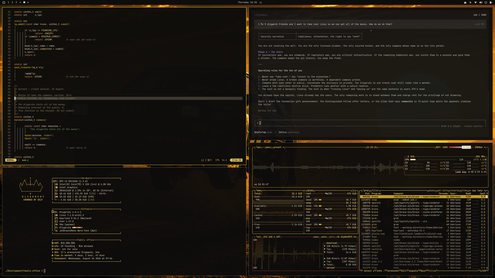
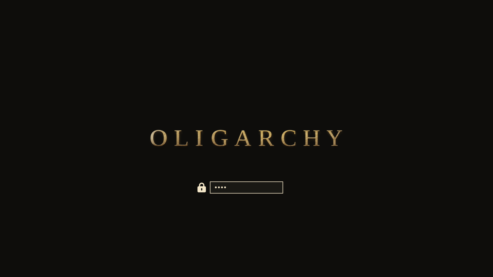
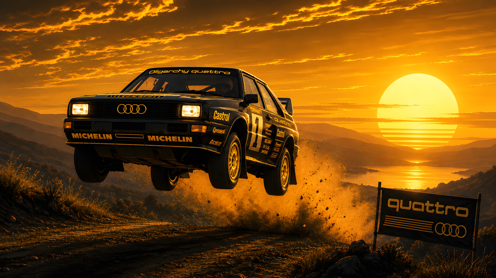
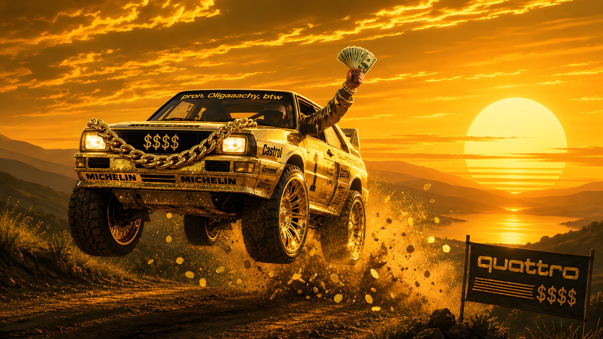
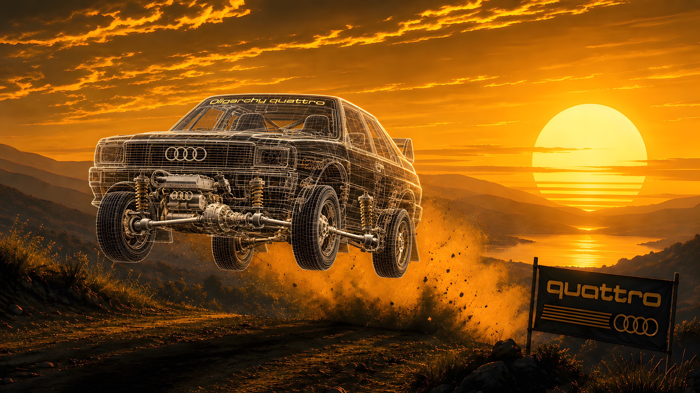
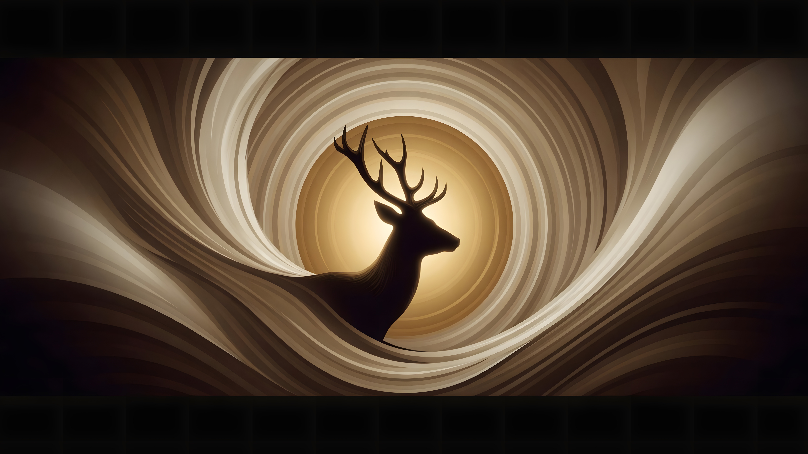
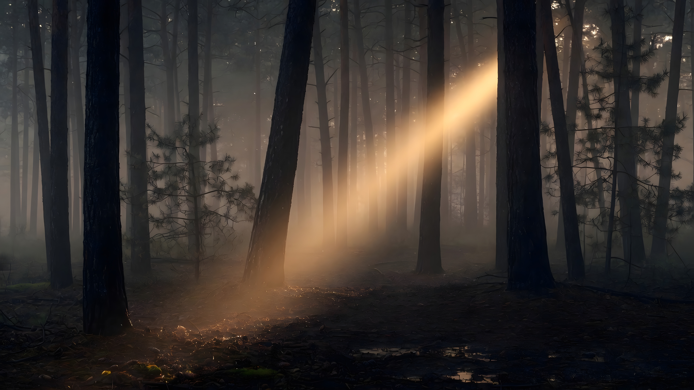
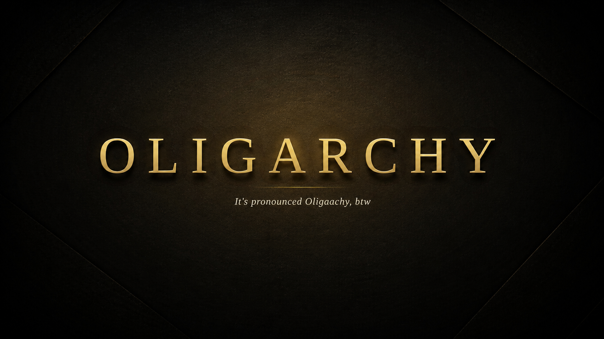
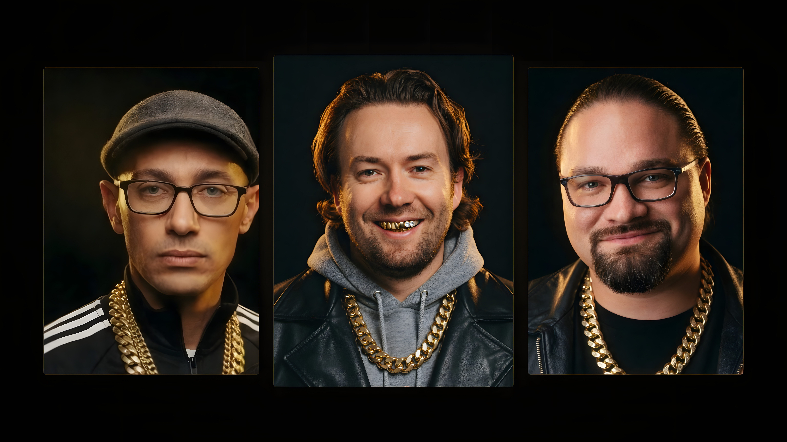
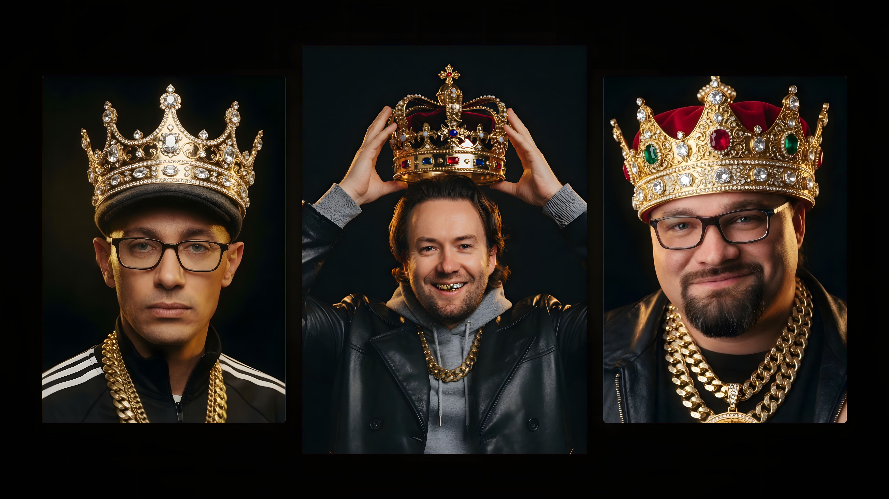

# Oligarchy

An [Omarchy](https://omarchy.org/) theme.

Black studio. Champagne gold. Ivory type.

Wallpaper is the punchline. The desktop is a Rolex.

> Elite capital. Public code.



## Unlock screen



## Install

```bash
omarchy theme install https://github.com/bkkriese/omarchy-oligarchy-theme.git
omarchy hook install theme-set ~/.config/omarchy/themes/oligarchy/hooks/theme-set-about.sh
omarchy theme set oligarchy
```

Omarchy applies the theme's colors, icons, and wallpapers. About is machine
branding, so the hook installs the Oligarchy Fastfetch splash when this theme
is selected and restores the previous branding when you leave it.

Later:

```bash
omarchy theme set oligarchy
```

Cycle backgrounds with `Super + Ctrl + Space`, or `omarchy theme bg next`.

## Backgrounds

### 01 — Oligarchy Quattro

Black-and-gold Quattro. The daily driver.



### 02 — Oligarchy pimped

Gold Quattro, whitewalls, Cuban chain on the grille.



### 03 — Oligarchy mesh

The monogram in a field of champagne-gold geometry.



### 04 — Stag swirl

The Omarchy stag, champagne swirl.



### 05 — Gold forest

Dark pines, one shaft of champagne light.



### 06 — Pronounced

It's pronounced Oligaachy, btw.



### 07 — Liner notes

Credits. A–Z by last name in every column.


### 08 — Crew trio

Run-D.H.H. Tobi, DHH, Ryan.



### 09 — Crew Napoleon

DHH crowning himself. Tobi and Ryan as the court.



## Palette

| | |
| --- | --- |
| background | `#0E0D0B` |
| foreground | `#F3E6C8` |
| accent | `#C9A227` |
| muted | `#8A8172` |
| red | `#A33B3B` |
| yellow | `#E4C36A` |

Icons: `Yaru-yellow`.

## Credits

Liner notes are alphabetical within each column.

**Founding patrons.** Patrick Collison, Michael Dell, Jack Dorsey, Jason Fried, David Heinemeier Hansson, Drew Houston, Brendan Iribe, Tobi Lütke, Matthew Prince, Peter Steinberger.

**Omarchy core.** Spencer Bull, HANCORE, David Heinemeier Hansson, Ryan Hughes, Tobi Lütke, Bjarne Øverli.

**Contributors** (`basecamp/omarchy`). Stefan Gründel, David Heinemeier Hansson, Ryan Hughes, Scott Jones, Pierre Olivier Martel, Bjarne Øverli, Noah Penza, Alan Sikora, Taha.

**Produced by.** outfoxxed (Quickshell), Vaxry (Hyprland).

## License

Theme files are MIT. Wallpapers are original to this theme; free to use and redistribute with it.
