# Oligarchy

An [Omarchy](https://omarchy.org/) theme.

Black studio. Champagne gold. Ivory type.

Wallpaper is the punchline. The desktop is a Rolex.

> Elite capital. Public code.

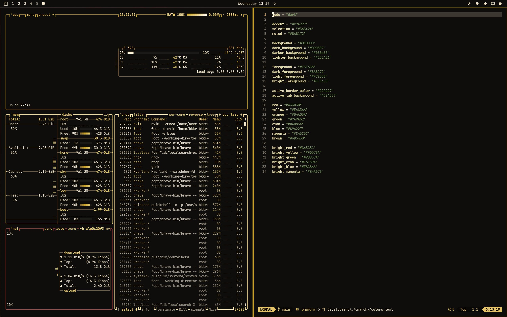

## Install

```bash
omarchy theme install https://github.com/bkkriese/omarchy-oligarchy-theme.git
omarchy hook install theme-set ~/.config/omarchy/themes/oligarchy/hooks/theme-set-about.sh
omarchy theme set oligarchy
```

Omarchy applies colors, icons, and wallpapers from the theme. About is machine branding, not a theme slot, so the hook is what includes the crown splash: it comes on with Oligarchy and the default comes back when you leave.

Later:

```bash
omarchy theme set oligarchy
```

Cycle backgrounds with `Super + Ctrl + Space`, or `omarchy theme bg next`.

## About

That's fastfetch — Omarchy's About screen. Hardware and software stay real. The rest is the joke.

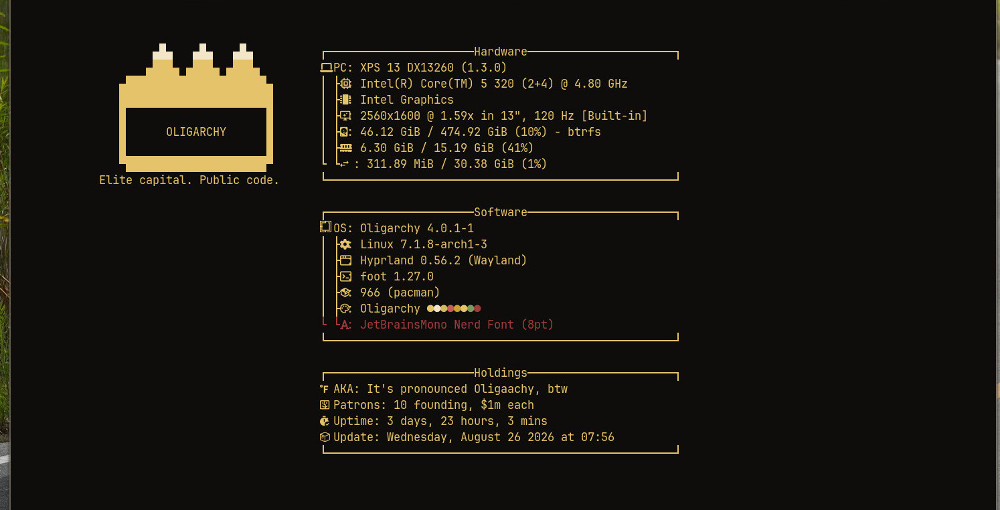

## Backgrounds

### 01 — Quattro gilded

Daily driver. Black-and-gold jumping Quattro.

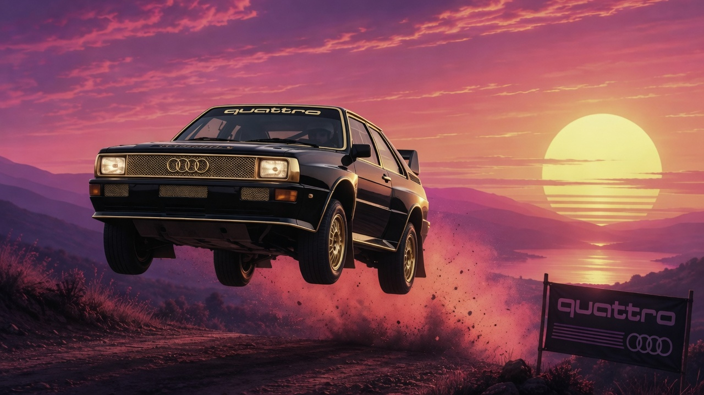

### 02 — Quattro pimped

Gold Quattro, whitewalls, Cuban chain on the grille.

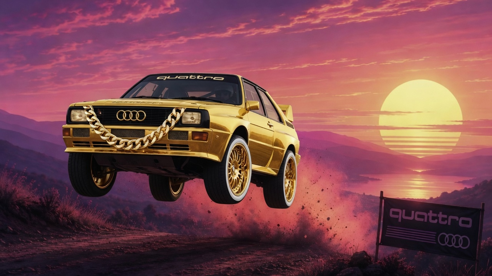

### 03 — Stag swirl

The Omarchy stag, champagne swirl.

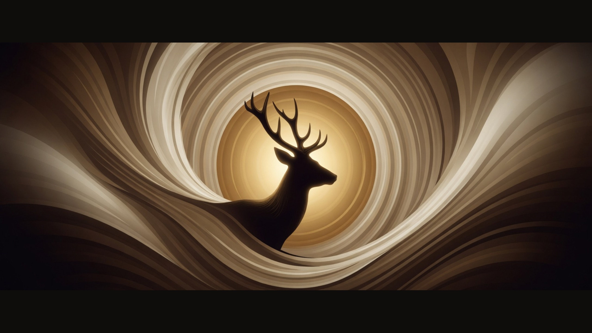

### 04 — Crew trio

Run-D.H.H. Tobi, DHH, Ryan.

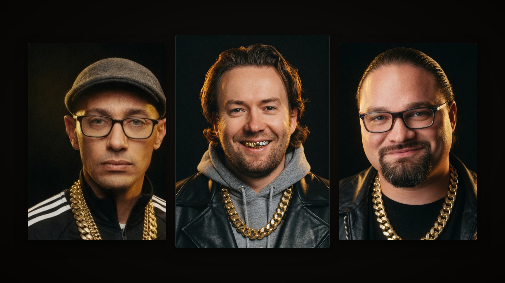

### 05 — Winding gold

Winding road at gold hour. The stag is still on the ridge.

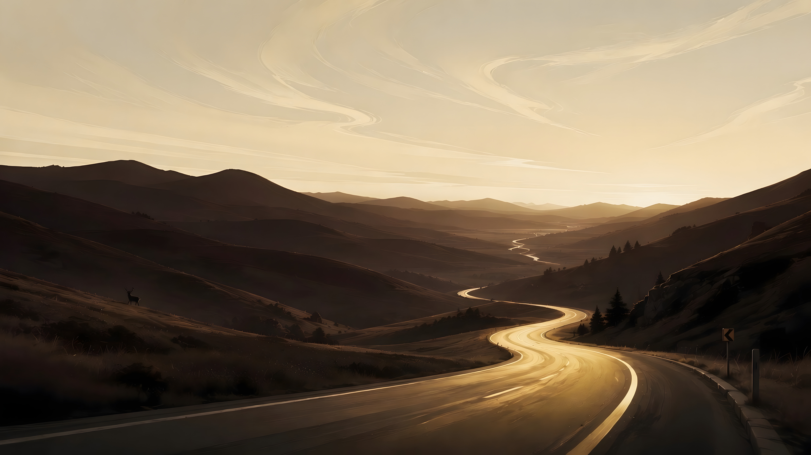

### 07 — Luxury macro

Chain, diamond Rolex, Audi-rings medallion.

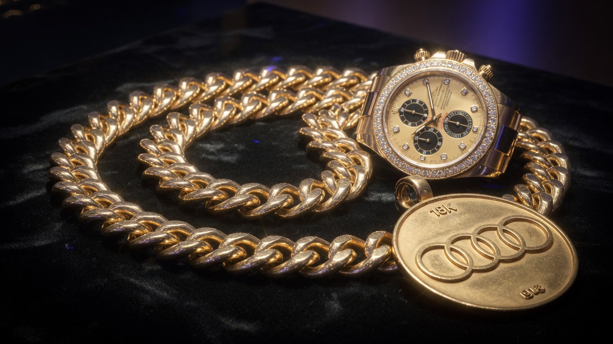

### 08 — Gold forest

Dark pines, one shaft of champagne light.

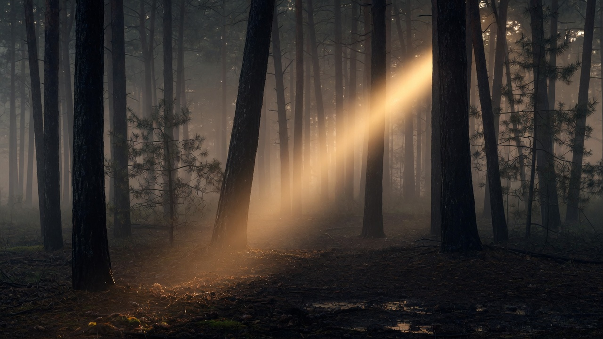

### 10 — Liner notes

Credits. A–Z by last name in every column.

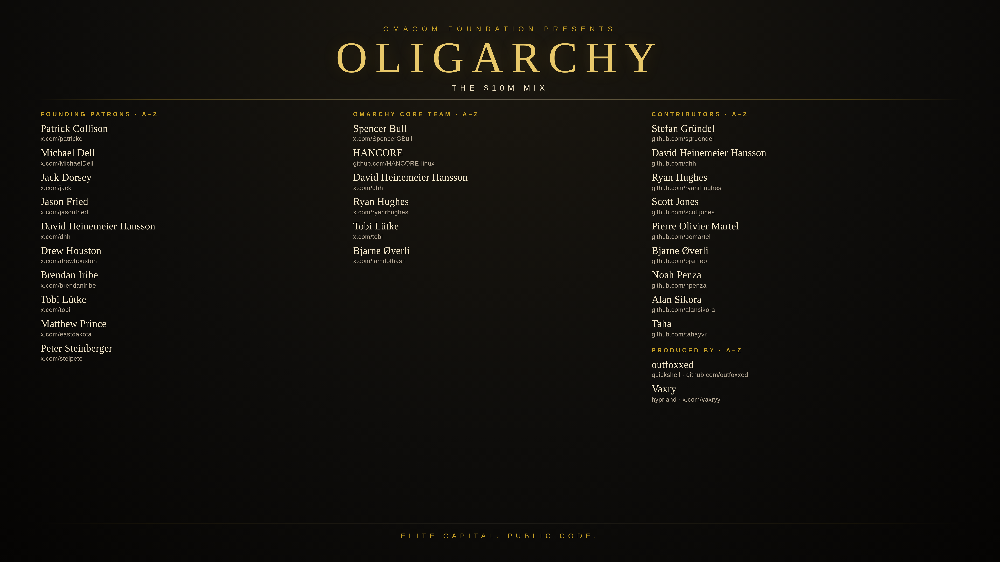

### 11 — Pronounced

It's pronounced Oligaachy, btw.

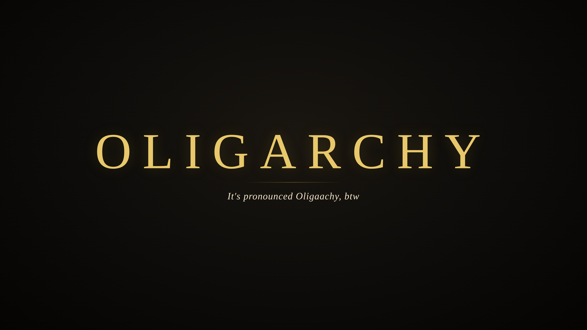

### 12 — Ryan chains

Same crew, Ryan stacked in extra gold.

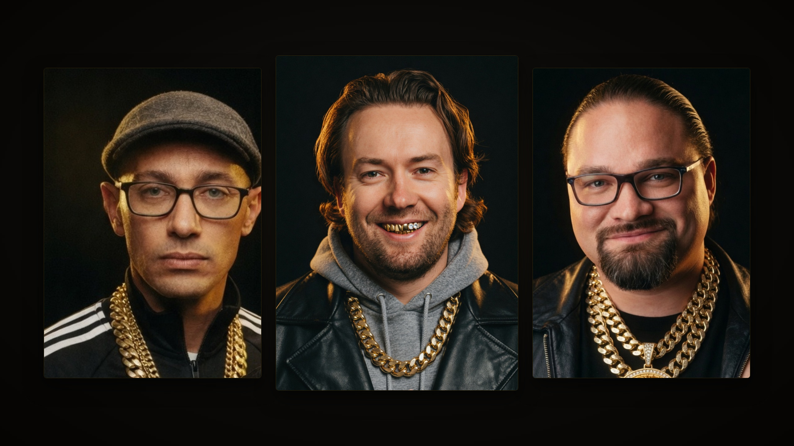

### 13 — Crowns

Garish jewelled crowns.

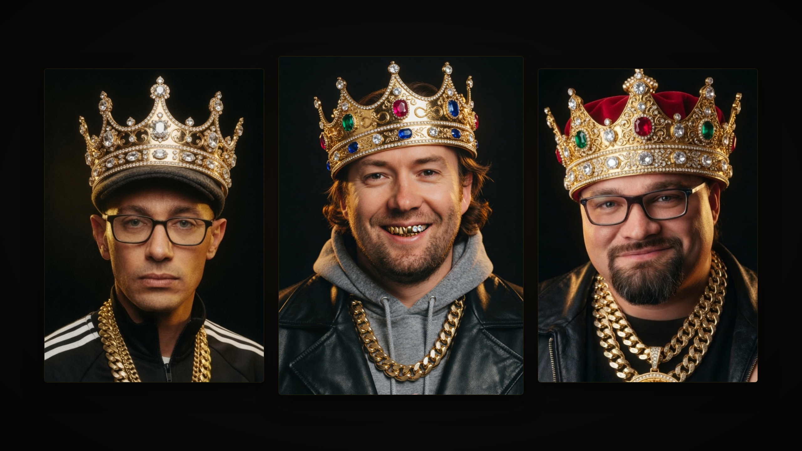

### 14 — Napoleon

DHH crowning himself. Tobi and Ryan as the court.

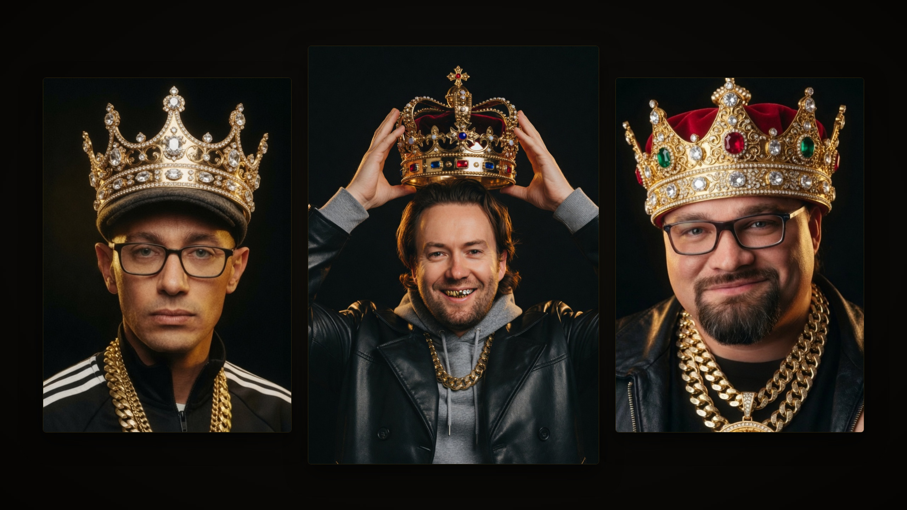

## Palette

| | |
| --- | --- |
| background | `#0E0D0B` |
| foreground | `#F3E6C8` |
| accent | `#C9A227` |
| muted | `#8A8172` |
| red | `#A33B3B` |
| yellow | `#E4C36A` |

Icons: `Yaru-yellow`.

## Credits

Liner notes are alphabetical within each column.

**Founding patrons.** Patrick Collison, Michael Dell, Jack Dorsey, Jason Fried, David Heinemeier Hansson, Drew Houston, Brendan Iribe, Tobi Lütke, Matthew Prince, Peter Steinberger.

**Omarchy core.** Spencer Bull, HANCORE, David Heinemeier Hansson, Ryan Hughes, Tobi Lütke, Bjarne Øverli.

**Contributors** (`basecamp/omarchy`). Stefan Gründel, David Heinemeier Hansson, Ryan Hughes, Scott Jones, Pierre Olivier Martel, Bjarne Øverli, Noah Penza, Alan Sikora, Taha.

**Produced by.** outfoxxed (Quickshell), Vaxry (Hyprland).

## License

Theme files are MIT. Wallpapers are original to this theme; free to use and redistribute with it.
